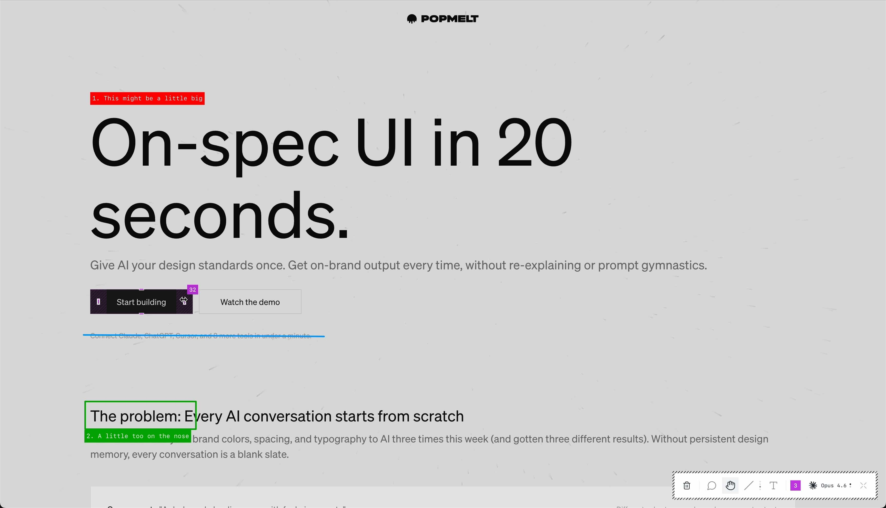

<p align="center">
  
</p>

# Popmelt

## What is it?

Popmelt is a design collaboration layer for AI models like Codex or Claude Code. It combines the best parts of collaborative design tools like Figma with the best way to design products today: in code, with AI, right in your browser. 

It's a good fit for anyone involved in UI Design and Engineering for the web: it doesn't require deep technical expertise to use, and it won't get in your way if you *do* have that knowledge and want to use it.

Drop it into any React codebase and get a full design-feedback loop: draw on your running UI, pin feedback to elements, adjust style and layout directly, and give your AI the visual and technical context it needs to execute your vision in a keystroke.

<p align="center">
  
</p>

**Popmelt is free to use and completely local**. It runs inside your codebase, with your existing AI CLI tools ([Claude Code](https://code.claude.com/docs/en/cli-reference), [Codex](https://developers.openai.com/codex/cli/)) handling code changes behind the scenes. You don't need an account to use it and we never see your data. 

## Why does it exist?

We're experienced product engineers and early adopters of AI coding models. We know their strengths, we know their weaknesses, and we've learned how to squeeze the best performance out of each generation. Popmelt was built to streamline our way of working, and we're proud to make it available to the design and engineering community.


## How do I set it up?

If you're a human, we recommend asking your AI to handle installation for you. We cover the basics below, but your AI should be able to integrate it into whatever setup you throw at it as long as it supports Node and React.

```bash
npm install @popmelt.com/core
```

Peer dependencies: `react >=18`, `react-dom >=18`, `lucide-react >=0.400` (toolbar icons).


### Frontend

Wrap your app in `PopmeltProvider`. In development, double-tap Cmd/Ctrl to open the toolbar.

```tsx
import { PopmeltProvider } from '@popmelt.com/core';

export default function App() {
  return (
    <PopmeltProvider>
      {/* your app */}
    </PopmeltProvider>
  );
}
```

### Backend

Start the bridge server so Popmelt can talk to Claude/Codex. In Next.js, `instrumentation.ts` is the cleanest place:

```ts
// instrumentation.ts (Next.js)
export async function register() {
  if (process.env.NODE_ENV === 'development' && process.env.NEXT_RUNTIME === 'nodejs') {
    const { startPopmelt } = await import('@popmelt.com/core/server');
    await startPopmelt({ port: 1111 });
  }
}
```

For other frameworks, call `startPopmelt()` anywhere in your dev server startup.

### That's it

Open your app in the browser and double-tap Cmd (or Ctrl) to toggle the toolbar. Draw, type, point at things, hit Cmd+Enter. Your AI sees your annotated screenshot and code context and gets to work.

## How do I use it?

### Annotation tools

| Tool | Shortcut | What it does |
|------|----------|-------------|
| **Comment** | `C` | Click any element to pin a comment. Captures tag, classes, React component name, and ancestor context. |
| **Handle** | `H` | Drag padding, gap, border-radius, font-size, and line-height handles directly on elements. Shift to snap to a scale. |
| **Rectangle** | `R` | Draw a rectangle to highlight a region. Auto-prompts for a text label. |
| **Oval** | `O` | Draw an ellipse. |
| **Line** | `L` | Draw a straight line. |
| **Pen** | `P` | Freehand drawing. |
| **Text** | `T` | Click to place a text label anywhere. |

<p align="center">
  
  
  
</p>

### Handle tool

Switch to the Handle tool (`H`) and hover any element to see draggable handles for its spatial properties:

- **Padding** — drag the inner edges of any element to adjust padding per-side. Hold Shift to snap to a scale (0, 2, 4, 8, 12, 16, 20, 24, 32).
- **Gap** — drag between flex or grid children to adjust row/column gap.
- **Border radius** — drag element corners to round them.
- **Font size** — drag the right edge of a text element to resize.
- **Line height** — drag below a text element to adjust leading.

All changes apply as inline styles instantly. Hold Cmd/Alt and swipe on a flex container to cycle `justify-content` or `flex-direction`; hold Shift and swipe to cycle `align-items`. Cmd+Z / Cmd+Shift+Z to undo/redo any change.

<p align="center">
  
</p>

### Style panel

Right-click any element with the Comment tool to open the style panel. Edit layout (flex/grid direction, alignment, gap, sizing), typography (size, weight, line-height, letter-spacing, color), backgrounds, borders, and effects. Every modification is tracked and included in the feedback sent to your AI.

### AI Collaboration

Cmd+Enter captures a full-page screenshot with your annotations baked in, bundles it with structured feedback (element selectors, style diffs, annotation text), and sends it to Claude or Codex via a local bridge server. Your AI reads the screenshot, sees exactly what you marked up, and edits your code. Cmd+C copies the screenshot to your clipboard instead.

- **Threaded conversations** — follow-up annotations on the same element continue the existing thread. Your AI sees prior context without re-explaining.
- **Questions** — if your AI needs clarification, it asks. A badge appears on the annotation; reply inline and the conversation continues.
- **Multi-task plans** — prefix your annotation with `/plan` and your AI decomposes the work into spatial tasks, each pinned to a region of the UI. Approve and they execute in sequence.
- **Provider switching** — toggle between Claude (Opus/Sonnet) and Codex at any time. Popmelt handles both.

<p align="center">
  
</p>

### Persistence

Annotations and style modifications save to localStorage automatically. Cmd+Backspace clears unsent annotations and modifications.

Thread history persists to `.popmelt/threads.json` in your project root for cross-session continuity.

## API

### `PopmeltProvider`

```tsx
<PopmeltProvider
  enabled={true}       // default: process.env.NODE_ENV === 'development'
  bridgeUrl="http://localhost:1111"  // default
>
```

### `startPopmelt(options?)`

```ts
await startPopmelt({
  port: 1111,            // bridge server port (default: 1111)
  projectRoot: '.',      // working directory for your AI
  claudePath: 'claude',  // path to Claude CLI binary
  maxTurns: 10,          // max turns per job
});
```

Returns `{ port: number, close: () => Promise<void> }`.

### `usePopmelt()`

```ts
const { isEnabled } = usePopmelt();
```

## Requirements

- React 18+
- Node.js 18+ (server)
- Claude CLI or Codex CLI installed for AI integration

## License

[PolyForm Shield 1.0.0](./LICENSE)

**tl;dr** you can use and extend this software freely for yourself and your team. You may not sell it, offer it as a managed service, or take our code and create a competing AI design collaboration product/service with it. The software is offered as-is, and you're responsible for its use in your projects.

**If you need a custom license** for your use case, contact [reb@popmelt.com](mailto:reb@popmelt.com) with a brief outline of your desired terms.


